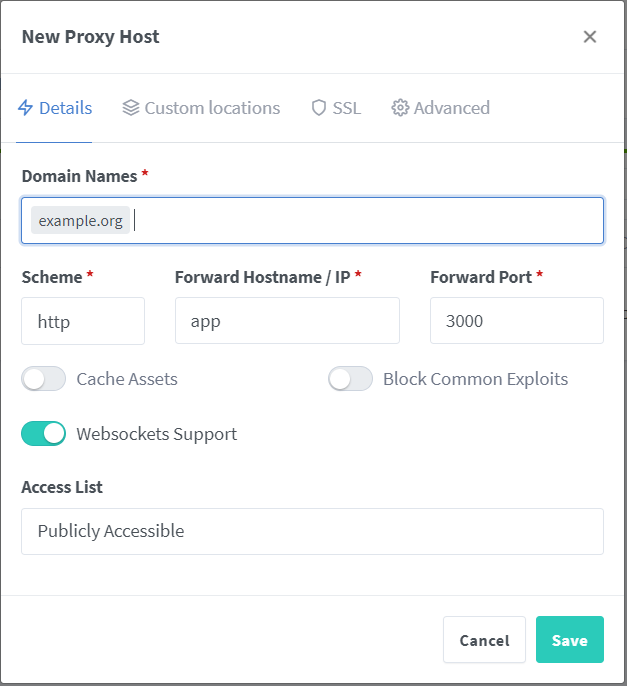
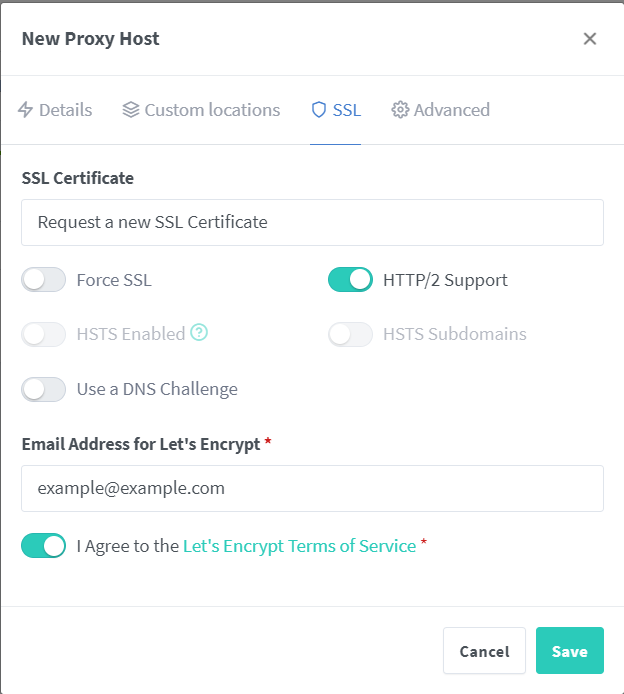
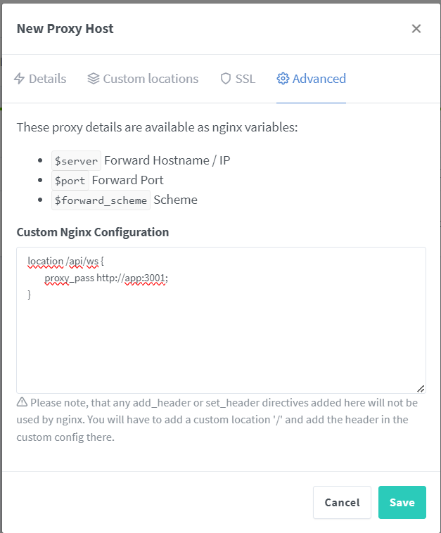

# Setup

## (optional) install pnpm

```bash
npm i -g pnpm
```

> in case you don't have `node` installed, then just look into the `/package.json` file to get the commands

## 1. Clone repo

```bash
git clone https://github.com/CultureConnectionLnu/hunger-games
pnpm run env
```

## 2. Clerk

- make a clerk account
- create an application
- copy keys and insert in `/env/.env.prod`

TODO: introduce roles

## 3. Start containers

```bash
pnpm deploy:prod
```

## 4. Nginx Proxy Manager

> replace `example.org` with your actual domain

Add proxy host



Use SSL certificate



Configure advanced for websocket connection



```config
location /api/ws {
    proxy_pass http://app:3001;
}
```
